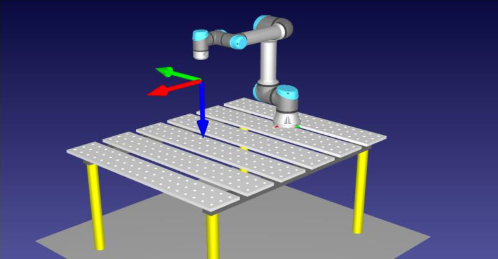
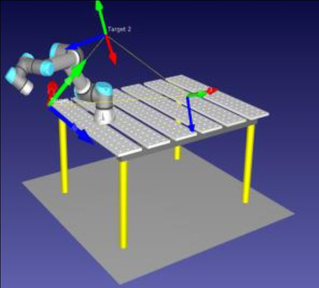
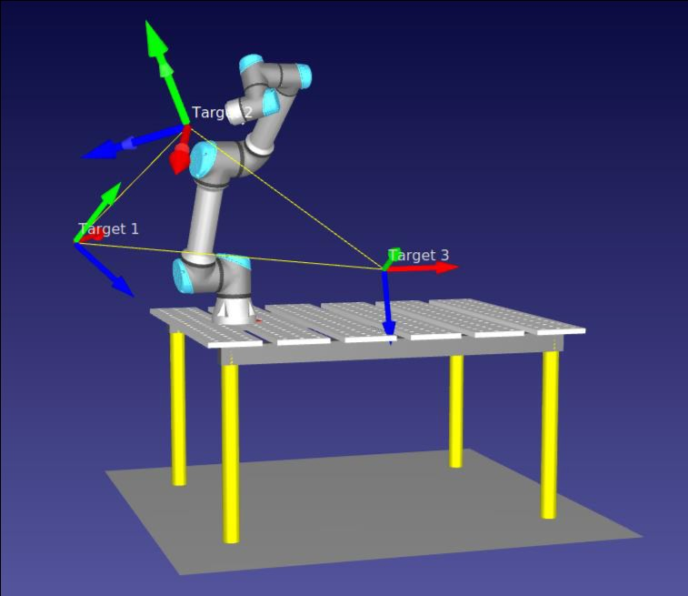
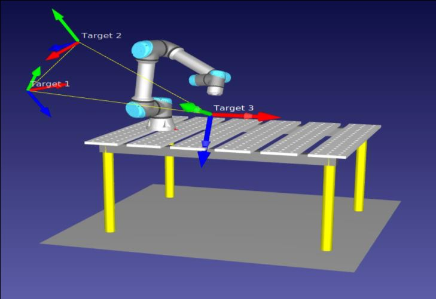
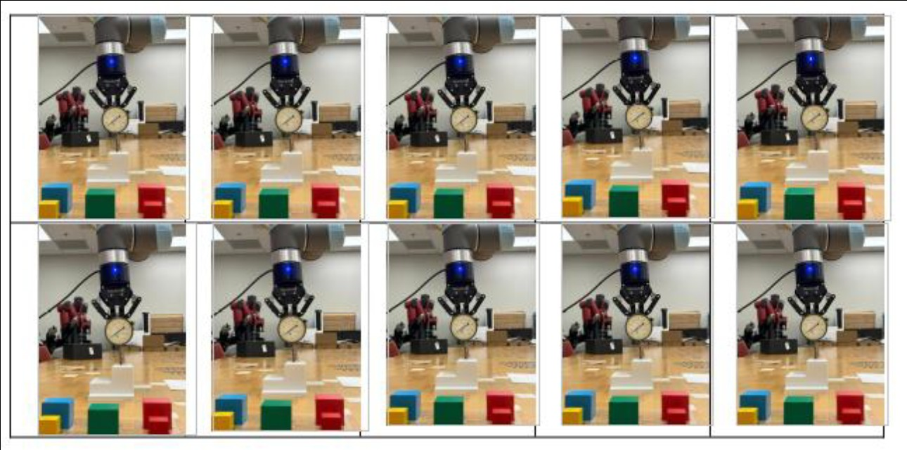
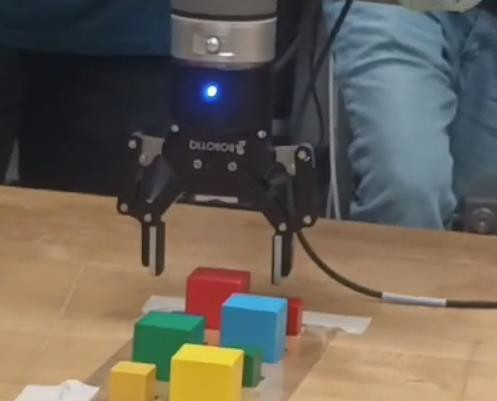
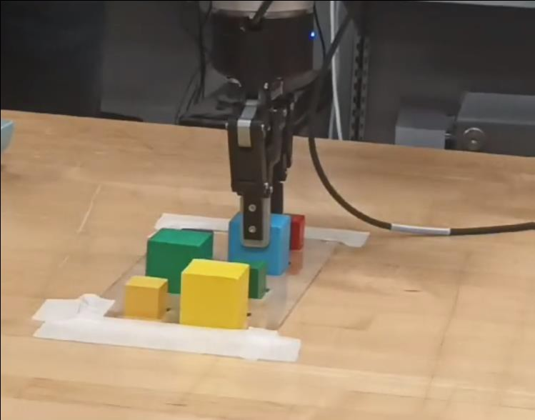
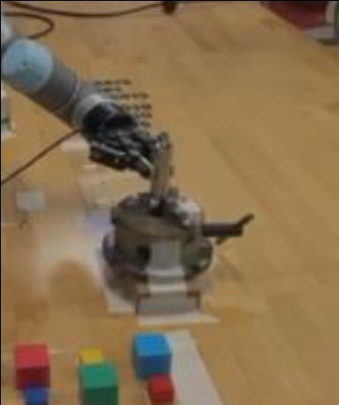
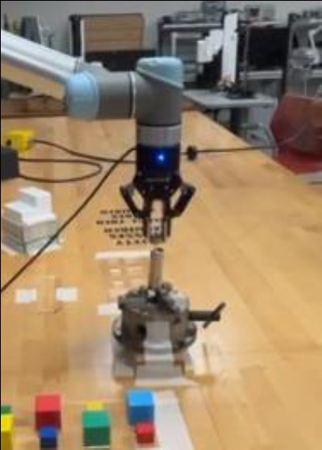
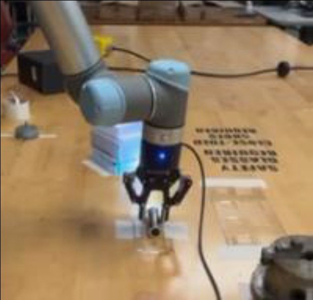

# Universal Robot UR5 — Technical Report

**Author:** Prajjwal Dutta  
**Affiliation:** Robotics and Autonomous Systems, Arizona State University, Arizona, USA  
**Date:** Fall 2023

---

## Abstract

The Universal Robot 5 (UR5) is a cutting-edge collaborative robotic arm that has revolutionized automation across various industrial applications. This technical report documents comprehensive hands-on experimentation covering three programming environments (PolyScope, RoboDK, URScript), workspace analysis, kinematics, gripper control, pick-and-place operations, and complex robotic assembly tasks. Through structured exercises, detailed understanding of the robot's kinematics, workspace characteristics, and various programming paradigms has been established and validated.

**Keywords:** Universal Robot UR5 · Way Points · PolyScope · RoboDK · URScript · End Effector · Programming Environment · Target Position · Joint Angles · Robot Control · Collaborative Robotics

---

## Table of Contents

- [Programming Environments & Introduction](#programming-environments--introduction)
- [Gripper Control & Repeatability Analysis](#gripper-control--repeatability-analysis)
- [Gripper Operations & Pick-and-Place Tasks](#gripper-operations--pick-and-place-tasks)
- [Flashlight Assembly & Precision Control](#flashlight-assembly--precision-control)
- [UR5 Specifications](#ur5-specifications)
- [Programming Environments Comparison](#programming-environments-comparison)
- [Conclusion](#conclusion)

---

## Programming Environments & Introduction

### Objective

This section covers foundational familiarization with the UR5 robot and its operation across three distinct programming environments: PolyScope, RoboDK, and URScript. The experimentation culminated in tracing all 8 vertices of a virtual cube using linear motion commands, demonstrating workspace mastery and motion control precision.

Three key technical areas were explored:
- **Robotic Programming Environments** — PolyScope for real-time control, RoboDK for offline simulation, and URScript for code-based programming.
- **Workspace Analysis** — Assessing the physical reach, obstacle limitations, and Z-axis constraints of the UR5.
- **Robot Kinematics** — Understanding joint space vs. Cartesian space coordinate systems and how they affect path planning.

---

### Waypoint Navigation via PolyScope

The robot was moved through 3 waypoints using both joint space and Cartesian space control. Joint space provided fine-grained control over each joint angle, while Cartesian space simplified path planning by specifying end-effector position and orientation directly.

| Pose   | X (mm) | Y (mm) | Z (mm) | RX (rad) | RY (rad) | RZ (rad) |
|--------|--------|--------|--------|----------|----------|----------|
| Pose 1 | -575   | -350   | 300    | 2.10     | 1.11     | 0.63     |
| Pose 2 | -240   | -445   | 650    | 1.57     | -1.57    | -1.57    |
| Pose 3 | 400    | -400   | 200    | 2.79     | -0.16    | 0        |

---

### Offline Simulation via RoboDK

The UR5 model was imported into RoboDK along with a table station. Three target positions were recorded and linked to linear joint space movements. The simulation was validated before deploying to the real robot.

- The UR5 model is imported with a table station environment.
- Three target positions are recorded using the target button.
- The main program uses linear joint space movement between targets.
- Target points are linked to three different linear joint spaces.
- Simulation is executed to verify the robot's movement before running on hardware.

| | |
|---|---|
|  |  |
| *UR5 default pose on table station* | *UR5 at Target 2 (extended reach)* |

| | |
|---|---|
|  |  |
| *Targets 1, 2, 3 — elevated arm configuration* | *Targets 1, 2, 3 — alternate view* |

---

### Programmatic Control via URScript

- Robot positions were defined programmatically using URScript.
- The program was written in a format compatible with PolyScope for storage and execution.
- The script was executed on the real robot, replicating the same waypoints as the PolyScope and RoboDK approaches.
- `rq_close()` and `rq_close_and_wait()` URScript functions were used for gripper control.

---

### Virtual Cube Tracing Experiment

The robot traced all 8 vertices of a virtual cube. `moveJ` (joint space) was used to reach the first corner, then `moveL` (linear Cartesian) for all subsequent vertices to ensure straight-line motion between each edge.

| Point | X (mm)   | Y (mm)   | Z (mm)  | RX (rad) | RY (rad) | RZ (rad) |
|-------|----------|----------|---------|----------|----------|----------|
| 1     | -140.07  | -609.05  | 424.95  | 3.080    | 0.585    | 0.035    |
| 2     | -140.06  | -659.00  | 424.98  | 3.080    | 0.585    | 0.035    |
| 3     | -90.03   | -658.96  | 425.01  | 3.080    | 0.585    | 0.035    |
| 4     | -90.04   | -608.98  | 425.01  | 3.080    | 0.585    | 0.035    |
| 5     | -140.07  | -609.05  | 424.95  | 3.080    | 0.585    | 0.035    |
| 6     | -90.05   | -609.02  | 324.98  | 3.080    | 0.585    | 0.035    |
| 7     | -140.05  | -609.00  | 324.96  | 3.080    | 0.585    | 0.035    |
| 8     | -140.09  | -658.98  | 324.97  | 3.080    | 0.585    | 0.035    |
| 9     | -90.04   | -658.97  | 325.02  | 3.080    | 0.584    | 0.035    |

Points 1–5 define the top face; Points 6–9 define the bottom face. The Euclidean distance between the diagonal corners (Points 1 and 6) gives the cube's side length:

```
d = sqrt((-140.06 - (-90.05))² + (-659.00 - (-609.02))² + (424.98 - 324.96)²)
d = sqrt(2500 + 2500 + 10000) ≈ 122.47 mm

Volume = d³ ≈ 1,803,438.54 mm³
```

#### Demo Videos

**Simulation:**


**Real Robot:**


---

## Gripper Control & Repeatability Analysis

### Gripper Control Interface via PolyScope

The objective was to learn how to open and close the ROBOTIQ adaptive gripper using PolyScope:

- The gripper control option in PolyScope toggles gripper status between ON and OFF.
- PolyScope allows setting the required gripping force to hold objects securely.
- The `rq_close()` and `rq_close_and_wait()` URScript functions replicate this control programmatically.
- The gripper open/close count can be tracked from the operating log or via URScript commands.

### Straightness and Repeatability Assessment

A digital pressure indicator was mounted perpendicular to the surface of a 3D-printed block. The robot followed two waypoints near opposite vertices of the block edge, and pressure readings were recorded across multiple iterations to assess repeatability.

- Two waypoints were selected near the vertices of the granite block face.
- The digital indicator measured pressure changes during edge tracing.
- The face was then traced using 4 waypoints at its four corners.
- The full process was repeated to quantify straightness and repeatability.

#### Results



*10-iteration repeatability test: The UR5 demonstrated good repeatability. Minor pressure variations were observed near the edges due to the 3D-printed surface not being perfectly smooth.*

---

## Gripper Operations & Pick-and-Place Tasks

This section covers practical applications of the ROBOTIQ adaptive gripper, including calibration procedures, pick-and-place operations, and precision insertion tasks.

### Gripper Opening and Closing Operations

- The robot was powered on and the gripper manual was followed to perform opening and closing actions.
- Additional gripper functions were explored using URScript.
- The tally of gripper open/close operations throughout its lifespan was determined.



*ROBOTIQ adaptive gripper positioned over a set of colored blocks*

### Load Cell Assembly and Force Calibration

- The load cell's location on the table was identified.
- Gripper force was calibrated in Newtons with consideration of speed and force settings.
- A program was authored to grip the load cell at varying force and speed settings, with data recording.

### Object Pick-and-Place Operations

A program was crafted to transfer blocks from one pallet to another without causing damage. Coordinate transformations from the robot's base frame to the pallets were determined, and variables were used for flexible positioning and orientation.



*UR5 performing pick-and-place — transferring colored blocks between pallets*

### Precision Dowel Pin Insertion and Removal

- A program was devised to insert and remove a 10mm dowel pin into holes of different sizes.
- A specific sequence was adhered to for transferring the pin between holes within the mating plate.

---

## Flashlight Assembly & Precision Control

The objective was to assemble a flashlight using the UR5 robot, a pneumatic chuck, and various flashlight components. This required precise movements and torque control.

### Assembly Steps

| Step | Action |
|------|--------|
| a | Place the flashlight head into the pneumatic chuck |
| b | Clamp the chuck using Digital I/O |
| c | Position the barrel onto the head |
| d | Screw the barrel until torque reaches **3 Nm** (monitored via `get_joint_torques()`) |
| e | Insert the battery pack into the barrel (correct polarity) |
| f | Place the tail cap onto the barrel |
| g | Align and screw the tail cap until torque reaches **2 Nm** |
| h | Unclamp the assembly with Digital I/O |
| i | Remove the assembled flashlight and place in tray |

| | |
|---|---|
|  |  |
| *Clamping the flashlight head into the pneumatic chuck* | *Barrel assembly stage with gripper* |



*UR5 with assembled flashlight — final result*

### Recommendations

- Maintain consistent component orientation throughout the process.
- Commence assembly at lower speeds and gradually increase efficiency.
- Use poses defined by joint angles to avoid exceeding joint limits.
- Implement gripper release methods to minimize part misalignment.
- Slower robot movements during part insertion enhance precision.

---

## UR5 Specifications

The UR5 is a 6-DOF collaborative robotic arm with the following joint configuration:

| Joint | Name      | Function |
|-------|-----------|----------|
| 1     | Base      | 360° horizontal rotation |
| 2     | Shoulder  | Vertical lift and positioning |
| 3     | Elbow     | Arm extension and bend |
| 4     | Wrist 1   | End-effector horizontal rotation |
| 5     | Wrist 2   | End-effector tilt/pitch |
| 6     | Wrist 3   | End-effector roll/twist |

**Usable Workspace:**

| Parameter | Value |
|-----------|-------|
| Maximum Reach | ~850 mm (~33.5 inches) |
| Workspace Shape | Spherical envelope |
| Degrees of Freedom | 6 |
| Collaborative | Yes (cobot) |

Key workspace characteristics:
- **Spherical Reach** — The arm can reach any point within a sphere of radius ~850 mm.
- **Work Height** — Can reach heights above floor level at various elevations.
- **Dexterity** — Reaches points at different angles including overhead and below its base.
- **Collaborative Workspace** — Designed to work safely alongside humans with built-in safety sensors.
- **Adjustable Reach** — Can be extended using external tooling, linear tracks, or other automation equipment.

---

## Programming Environments Comparison

| Feature | PolyScope | RoboDK | URScript |
|---------|-----------|--------|----------|
| Interface | Graphical (GUI) | Simulation + GUI | Text-based |
| Learning Curve | Low | Medium | High |
| Control Level | High-level | High-level + detailed | Fine-grained |
| Best For | Real-time control, beginners | Offline simulation, path planning | Custom algorithms, advanced control |
| Customization | Limited | Extensive | Fully customizable |
| Simulation | Built-in (basic) | Full offline simulation | None |

**Summary:**
- **PolyScope** is ideal for quick setup, real-time execution, and introductory tasks. Best for beginners.
- **RoboDK** excels in offline programming with detailed path planning and simulation. Best for advanced projects requiring precise motion control.
- **URScript** provides the highest level of control and flexibility, but requires programming expertise. Best for specialized and complex applications.

---

## Conclusion

The lab tasks and initial modules provided a deep understanding of the specifications and programming of the UR5 collaborative robot. Key takeaways:

- Learned the UR5 industrial robot specifications and its 6-DOF joint configuration.
- Understood the difference between Joint and Cartesian space using `moveJ` and `moveL` commands.
- Validated robot simulation in PolyScope and RoboDK before deploying to the real robot.
- Traced all 8 vertices of a virtual cube using linear motion commands, achieving a computed cube volume of ~1,803,438.54 mm³.
- Compared three programming environments and understood the trade-offs between PolyScope, RoboDK, and URScript.
- Explored the safe interaction principles between humans and the robot's collaborative workspace.
- Performed gripper calibration, pick-and-place operations, and a full flashlight assembly sequence using torque-controlled screwing.

---

---

*Robotics and Autonomous Systems — Arizona State University*  
*Technical Report: Universal Robot UR5 Programming and Operations*
